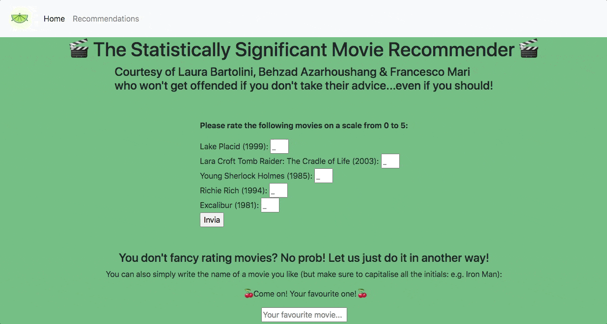

# Movie RecommenderS
Flask app based website for 2 movies recommenders: 
- one based on 5 movies rating, using Collaborative Filtering NMF (non-negative matrix factorization) as rating model 
- the second based on the user favourite movie via Neighborhood-based Cosine-Similarity model.

This unsupervised learning model example train on data from [MovieLens Dataset](https://grouplens.org/datasets/movielens/) 100k small dataset. The project is builted to save the input from the user, uptating the database and improving the models every 12 hours. ⏰

###  ➡️  Repo Structure
* Data: 
    * raw: from [MovieLens Dataset](https://grouplens.org/datasets/movielens/) 100k small dataset
    * prepocessed: the final dataset with the new user imput uptated every 12h. 

* MICE_imputer -> module to generate the clean `df_final.csv` datset filling the missing rating using Multivariate Imputation by Chained Equations: an imputation algorithm which replaces missing data values through an iterative series of predictive models, in this case a Random Forest regression model.

* Webapp:
    * app.py -> the main program to run to visualize your the website on your browser
    * recommendation_model.py -> train the NFM model based on the updated final dataset in data/preprocessed folder
    * knn_recommending_engine.py -> second model using KNN with cosine similarity distance
    * recommending_engine.py -> generate the predictions based on the NFM model and update df_final.csv file with new ratings by new users.
   
    * webscraper_img.py -> generate the link to the recommended movies

    * templates/: contains html files for the graphic visualisation
    * static/: contains CSS files for the webpages

### Credits

This project was done in collaboration with [Francesco Mari](https://github.com/fra-mari) & [Behzad Azarhoushang](https://github.com/behzad1195).
